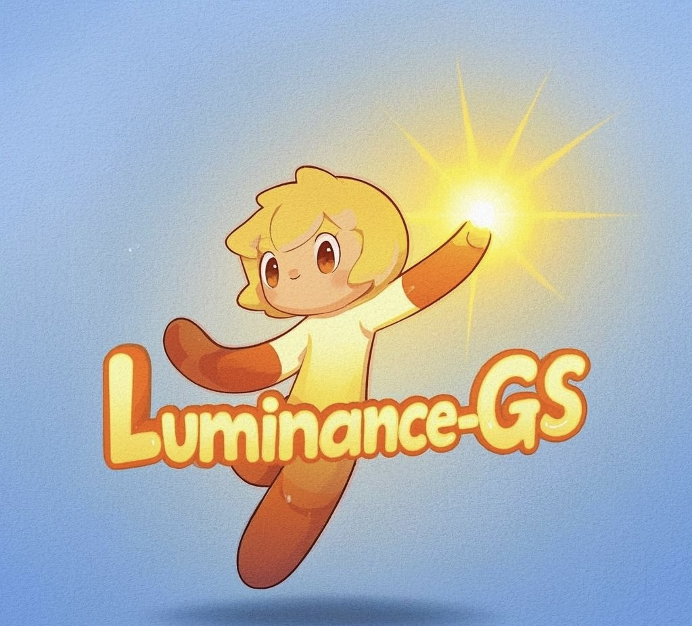

# [CVPR 2025] Luminance-GS: Adapting 3D Gaussian Splatting to Challenging Lighting Conditions with View-Adaptive Curve Adjustment

[(Paper Link)](https://arxiv.org/pdf/2504.01503), [(Extended Journal Link)](https://arxiv.org/abs/2602.18322), [(Website Link)](https://cuiziteng.github.io/Luminance_GS_web/).

**2026.5.10 :** Thanks for the open issue, I fixed some bugs in Luminance-GS training.

**2026.2.25 :** The extended version, **Luminance-GS++**, has been released, link [here](https://arxiv.org/abs/2602.18322)!

**2025.2.27 :** Paper accepted by **CVPR 2025** ! 

**2025.4.27 :** Code and dataset released !

<div align="center">
  
</div>
</p>

Luminance-GS: Adapting 3D Gaussian Splatting to Challenging Lighting Conditions with View-Adaptive Curve Adjustment ([Conference Version](https://cuiziteng.github.io/Luminance_GS_web/))

[Ziteng Cui*<sup>1</sup>](https://cuiziteng.github.io/), 
[Xuangeng Chu<sup>1</sup>](https://xg-chu.site/), 
[Tatsuya Harada<sup>1,2</sup>](https://www.mi.t.u-tokyo.ac.jp/harada/). 

<sup>1.</sup>The University of Tokyo, <sup>2.</sup>RIKEN AIP.

Unifying Color and Lightness Correction with View-Adaptive Curve Adjustment for Robust 3D Novel View Synthesis ([Journal Version](https://arxiv.org/pdf/2602.18322))

[Ziteng Cui<sup>1</sup>](https://cuiziteng.github.io/), 
[Shuhong Liu<sup>1</sup>](https://shuhongll.github.io/)
[Xiaoyu Dong<sup>1</sup>](https://scholar.google.com/citations?user=gAcwbIkAAAAJ&hl=en)
[Xuangeng Chu<sup>1</sup>](https://xg-chu.site/), 
[Lin Gu*<sup>2</sup>](https://sites.google.com/view/linguedu/home)
[Ming-Hsuan Yang<sup>3</sup>](https://scholar.google.com/citations?hl=en&user=p9-ohHsAAAAJ)
[Tatsuya Harada<sup>1,4</sup>](https://www.mi.t.u-tokyo.ac.jp/harada/). 

<sup>1.</sup>The University of Tokyo, <sup>2.</sup>Tohoku University, <sup>3.</sup>UC Merced, <sup>4.</sup>RIKEN AIP.

### Use The Code:

```
cd Luminance-GS
```

### Citation:
```
 @inproceedings{cui_luminance_gs,
	  title = {Luminance-GS: Adapting 3D Gaussian Splatting to Challenging Lighting Conditions with View-Adaptive Curve Adjustment},
	  author = {Cui, Ziteng and Chu, Xuangeng and Harada, Tatsuya},
	  booktitle={CVPR},
	  year={2025}}
```
```
@misc{cui_luminance_gs_plus_plus,
      title={Unifying Color and Lightness Correction with View-Adaptive Curve Adjustment for Robust 3D Novel View Synthesis}, 
      author={Ziteng Cui and Shuhong Liu and Xiaoyu Dong and Xuangeng Chu and Lin Gu and Ming-Hsuan Yang and Tatsuya Harada},
      year={2026},
      eprint={2602.18322},
      archivePrefix={arXiv},
      primaryClass={cs.CV},
      url={https://arxiv.org/abs/2602.18322}, 
}
```
### Dataset Citation:
```
@inproceedings{cui_aleth_nerf,
	  title={Aleth-NeRF: Illumination Adaptive NeRF with Concealing Field Assumption},
	  author={Cui, Ziteng and Gu, Lin and Sun, Xiao and Ma, Xianzheng and Qiao, Yu and Harada, Tatsuya},
	  booktitle={Proceedings of the AAAI Conference on Artificial Intelligence},
	  year={2024}
}
```

### 📖: Some Also Great Co-current Works (almost 3DGS in dark):

**sRGB-based:** 

[PG 2024] [Gaussian in the Dark: Real-Time View Synthesis From Inconsistent Dark Images Using Gaussian Splatting](https://arxiv.org/abs/2408.09130)

[IROS 2024] [DarkGS: Learning Neural Illumination and 3D Gaussians Relighting for Robotic Exploration](https://tyz1030.github.io/proj/darkgs.html)

[CVPR 2025] [lita-gs: illumination-agnostic novel view synthesis via reference-free 3d gaussian splatting and physical priors](https://arxiv.org/html/2504.00219v1)

[Arxiv 2025] [LL-Gaussian: Low-Light Scene Reconstruction and Enhancement via Gaussian Splatting for Novel View Synthesis](https://sunhao242.github.io/LL-Gaussian_web.github.io/)

**RAW-based:**

[NIPS 2024] [Lighting Every Darkness with 3DGS: Fast Training and Real-Time Rendering for HDR View Synthesis](https://srameo.github.io/projects/le3d)

[NIPS 2024] [From Chaos to Clarity: 3DGS in the Dark](https://arxiv.org/html/2406.08300v1)
